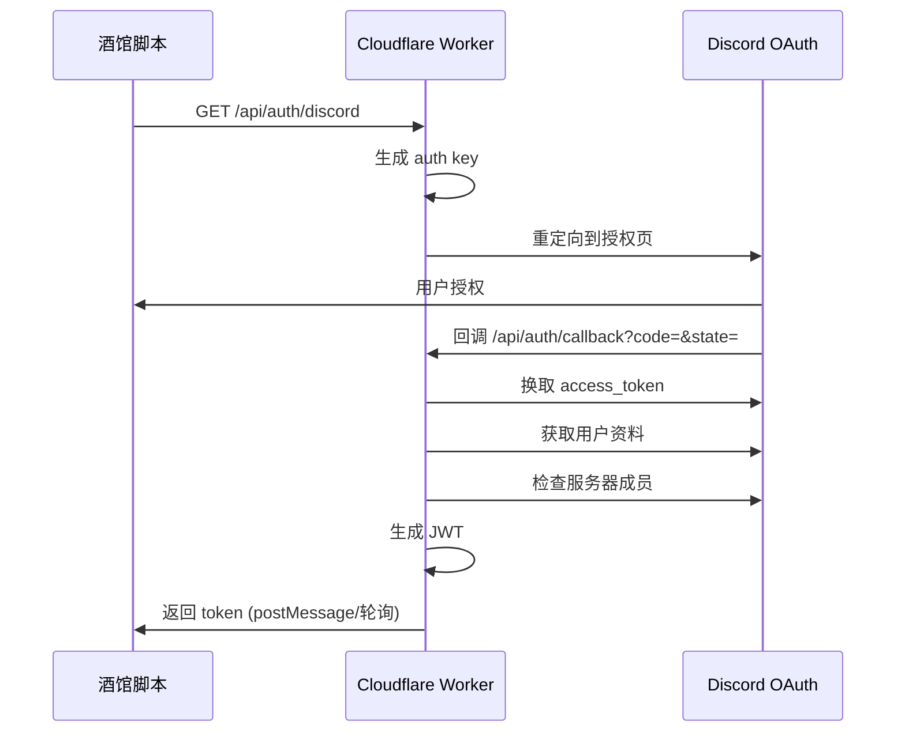

# 规则创意工坊后端 - 完整可部署 Worker 代码

## 项目概述

创建一个完整的 Cloudflare Worker 后端，支持 Discord OAuth 认证、内容管理、审核流程和搜索功能。

## 文件清单

### 配置文件

- `wrangler.toml` - Worker 配置（路由、KV、环境变量）
- `package.json` - 依赖管理
- `tsconfig.json` - TypeScript 配置

### 核心代码

- `src/index.ts` - Worker 入口，错误处理、CORS
- `src/router.ts` - 路由定义和分发
- `src/types.ts` - 全局类型定义

### 功能模块

- `src/handlers/auth.ts` - Discord OAuth 授权、回调、轮询
- `src/handlers/content.ts` - 内容创建、读取、更新、删除
- `src/handlers/admin.ts` - 管理员审核接口
- `src/handlers/search.ts` - 内容搜索

### 中间件

- `src/middleware/auth.ts` - JWT 验证、管理员权限检查

### 工具函数

- `src/utils/jwt.ts` - JWT 签名和验证
- `src/utils/kv.ts` - KV 存储辅助函数
- `src/utils/response.ts` - 标准响应封装

### 数据模型

- `src/models/content.ts` - 内容类型定义和 KV key 生成器

## 核心功能

### 认证流程




### 内容管理流程

- 创建内容 → pending 状态 → 管理员审核 → approved/rejected
- KV 存储分离：metadata（小体积索引）+ data（大内容分开存）
- 多重索引：按状态、按作者、按标签、按时间

### API 端点


| 端点                       | 方法   | 权限              | 功能            |
| -------------------------- | ------ | ----------------- | --------------- |
| /api/auth/discord          | GET    | 公开              | 开始 OAuth 授权 |
| /api/auth/callback         | GET    | 公开              | OAuth 回调处理  |
| /api/auth/poll             | GET    | 公开              | 轮询登录状态    |
| /api/content/list          | GET    | 公开              | 浏览内容列表    |
| /api/content/get/:type/:id | GET    | 公开/受限         | 获取内容详情    |
| /api/content/search        | GET    | 公开              | 搜索内容        |
| /api/content/create        | POST   | 需登录+服务器成员 | 创建内容        |
| /api/content/update/:id    | PUT    | 需作者/管理员     | 更新内容        |
| /api/content/delete/:id    | DELETE | 需作者/管理员     | 删除内容        |
| /api/admin/pending         | GET    | 管理员            | 获取待审核列表  |
| /api/admin/review/:id      | POST   | 管理员            | 审核内容        |
| /api/stats                 | GET    | 公开              | 获取统计数据    |


## 部署配置

### Discord App 设置

1. 访问 [https://discord.com/developers/applications](https://discord.com/developers/applications)
2. 创建 New Application
3. OAuth2 → Redirects: `https://your-worker.workers.dev/api/auth/callback`
4. 获取 Client ID 和 Client Secret

### Cloudflare 设置

1. 创建 KV namespace: `wrangler kv:namespace create KV`
2. 设置 secrets:
  - `DISCORD_CLIENT_SECRET`
  - `JWT_SECRET`
3. 修改 wrangler.toml 中的 `DISCORD_CLIENT_ID` 和 `DISCORD_GUILD_ID`

### 部署命令

```bash
npm install
wrangler deploy
```

## 存储设计

### KV Key 结构

```
meta:{type}:{id}        - 内容元数据
 data:{type}:{id}        - 内容数据（大对象）
idx:{type}:pending       - 待审核内容ID列表
idx:{type}:approved      - 已通过内容ID列表
author:{discordId}       - 用户发布的内容列表
tag:{tag}                - 标签反向索引
session:{key}            - OAuth 会话
user:{discordId}         - 用户资料
time:{type}              - 时间排序索引
```

### 内容类型支持

- world-rule - 世界规则模板
- regional-rule - 区域规则模板
- personal-rule - 个人规则模板
- region - 区域场景（含建筑）
- building - 单个建筑
- character - 角色模板
- sticker - 表情包（原有兼容）

